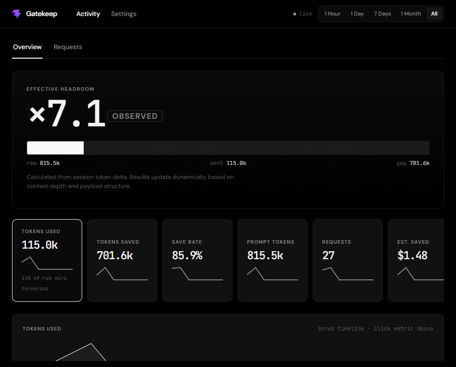

# Gatekeep

<p align="center">
  
</p>

<p align="center"><em>Example session view (27 requests): 815k raw tokens reduced to 115k sent (85.9% save rate, ×7.1 observed headroom). Multipliers update live per request.</em></p>

**Self-hosted proxy that compresses AI coding CLI traffic.** Point Claude Code, Cursor, Codex, or Vibe at Gatekeep once. Same workflow, fewer tokens billed upstream.

## Features

- **High-Impact Token Savings:** Up to 85%+ token reduction on deep agent loops and heavy multi-turn contexts via wire crush and tool minification
- **Real-time metrics dashboard** tracking live token deltas, save rates, and dynamic capacity multipliers per request
- **Transparent pass-through** with sub-40ms average proxy overhead
- **Multi-provider routing:** Anthropic, Cursor ConnectRPC, ChatGPT Codex, Mistral/Vibe, OpenAI-compatible APIs
- **Zero workflow disruption:** wire once, run your CLIs normally
- Docker-first install with one-shot wire scripts for client machines
- Optional `GATEKEEP_API_KEY` for proxy authentication

## Requirements

- **Production:** Docker and Docker Compose
- **Development:** Python 3.12+, Node.js 22+ (frontend build), pip

Default ports: **9477** (proxy + dashboard), **9478** (Cursor agent listener).

## Quick start

```bash
git clone <repo-url> gatekeep && cd gatekeep
cp .env.example .env
./install/install.sh
```

Open the dashboard at http://127.0.0.1:9477/dashboard/

On a remote server, set `GATEKEEP_PUBLIC_URL` and `GATEKEEP_AGENT_URL` in `.env` before starting. See [docs/INSTALL.md](docs/INSTALL.md).

## Wire coding CLIs

From a client machine (PowerShell):

```powershell
$g='http://YOUR-SERVER:9477'; $a='http://YOUR-SERVER:9478'; $f=Join-Path $env:TEMP 'gk-wire.ps1'; irm "$g/install/wire-agents.ps1" -OutFile $f; & $f -GatekeepUrl $g -AgentUrl $a
```

The dashboard Wiki tab shows the exact command for your deployment.

Manual details: [docs/AGENTS.md](docs/AGENTS.md)

## Development

```bash
pip install -r backend/requirements.txt
cd frontend && npm install && npm run build
cd ../backend && uvicorn main:app --host 127.0.0.1 --port 9477
```

Set `GATEKEEP_DEBUG=1` for verbose proxy logging.

## Documentation

| Doc | Purpose |
|-----|---------|
| [docs/INSTALL.md](docs/INSTALL.md) | Install, remote deploy, operations |
| [docs/AGENTS.md](docs/AGENTS.md) | CLI wiring reference |
| [.env.example](.env.example) | Environment variables |

## License

Copyright (c) 2026 Sealeria. Gatekeep is licensed under [AGPL-3.0-or-later](LICENSE).
